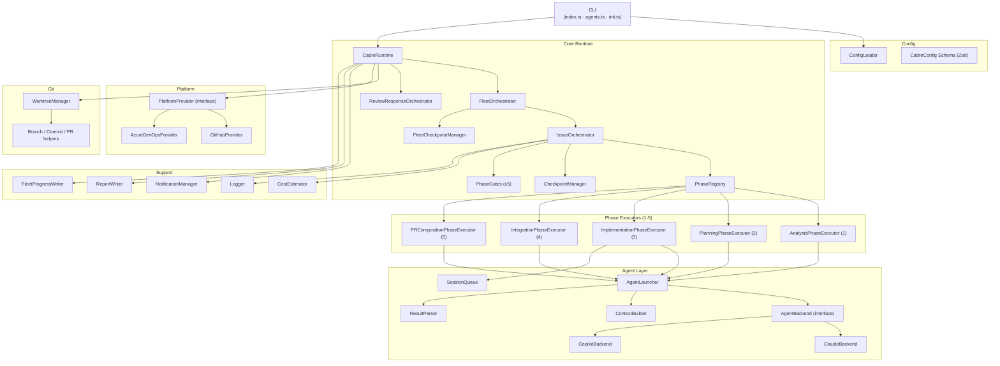
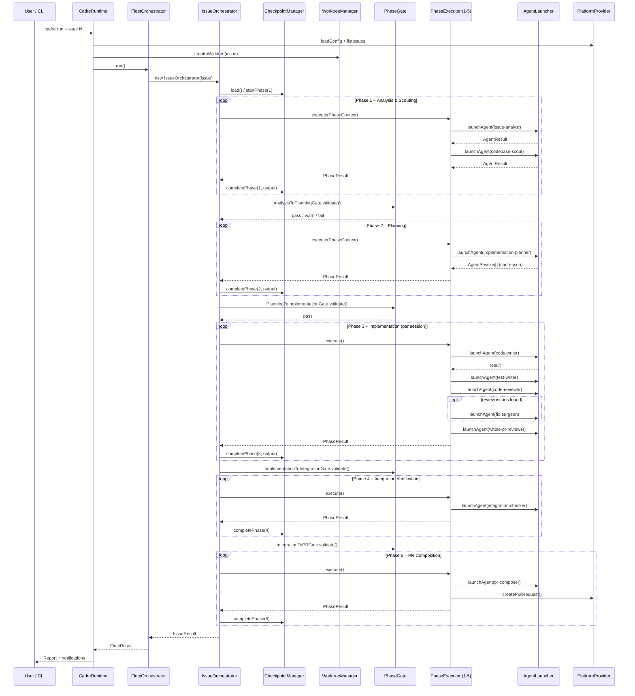
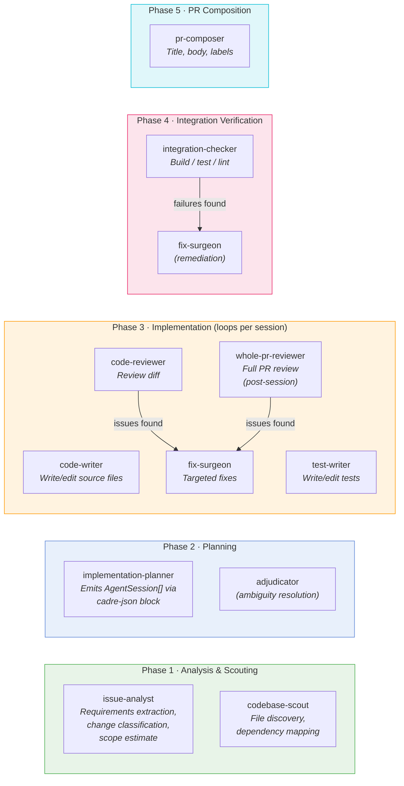
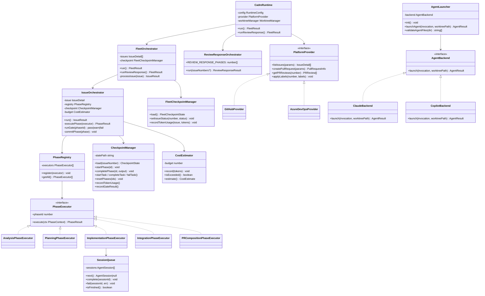
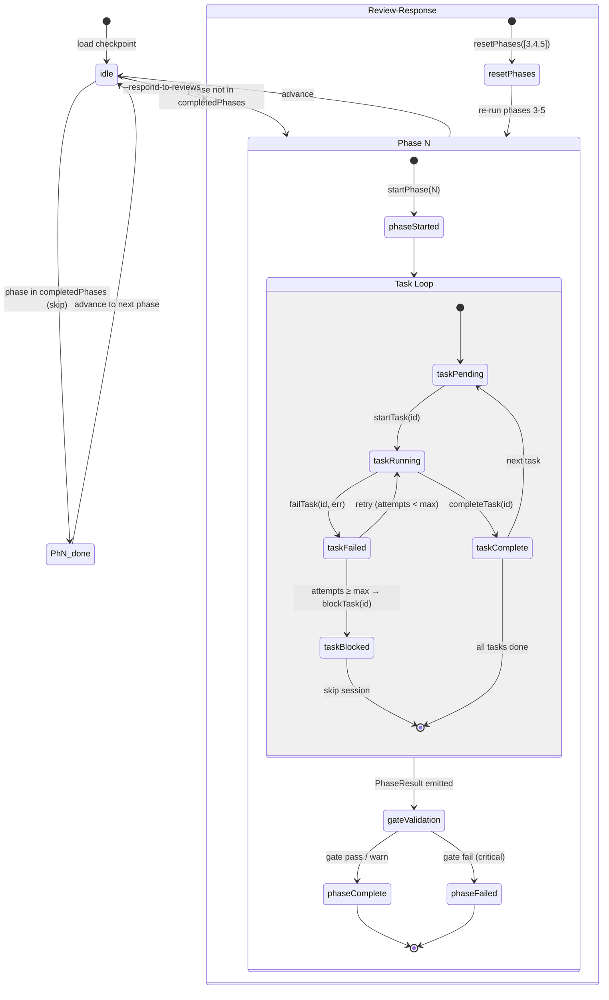
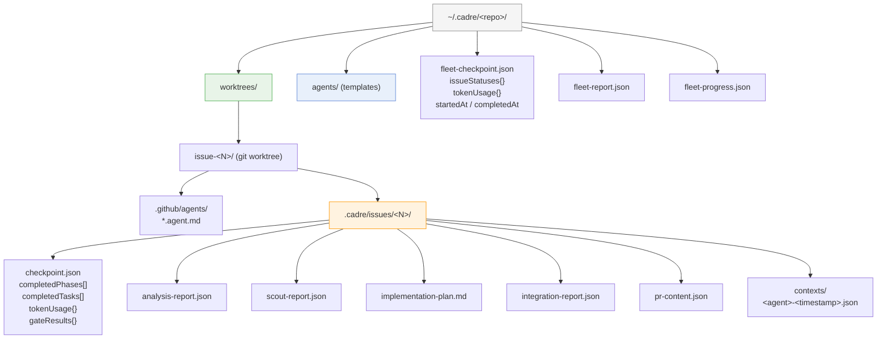
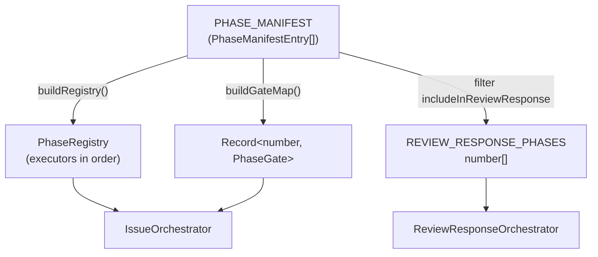
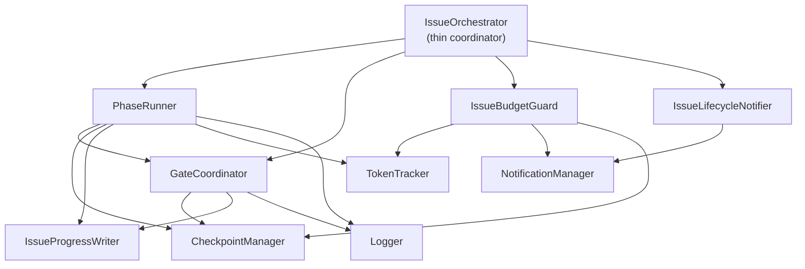

# Cadre Architecture

**Cadre** (Coordinated Agent Development Runtime Engine) is a multi-phase, AI-agent pipeline that autonomously resolves GitHub/ADO issues by coordinating a fleet of specialized agents across a structured 5-phase workflow.

---

## 1. High-Level Component Architecture

---

## 2. Per-Issue Pipeline Sequence

The standard pipeline runs all 5 phases sequentially. `--respond-to-reviews` re-runs phases 3–5 after resetting their checkpoint state.

---

## 3. Agent Assignment by Phase

---

## 4. Core Class Relationships

---

## 5. Artifact / Data Flow Through the Pipeline

Each phase produces structured JSON or Markdown artifacts consumed by the next gate and phase. The checkpoint tracks all of this durably.

```mermaid
flowchart LR
    ISSUE[("GitHub / ADO\nIssue #N")]

    subgraph Phase1["Phase 1 · Analysis"]
        P1A["issue-analyst"]
        P1B["codebase-scout"]
        P1O[/"analysis-report.json\nscout-report.json"/]
    end

    subgraph G12["Gate 1→2\nAmbiguity check"]
        GR12{"pass?"}
    end

    subgraph Phase2["Phase 2 · Planning"]
        P2["implementation-planner"]
        P2O[/"implementation-plan.md\n(cadre-json sessions[])"/]
    end

    subgraph G23["Gate 2→3\nSession schema check"]
        GR23{"pass?"}
    end

    subgraph Phase3["Phase 3 · Implementation (×sessions)"]
        P3A["code-writer"]
        P3B["test-writer"]
        P3C["code-reviewer"]
        P3D["fix-surgeon"]
        P3E["whole-pr-reviewer"]
        P3O[/"source diff\ntest files\nreview-result.json"/]
    end

    subgraph G34["Gate 3→4\nDiff present check"]
        GR34{"pass?"}
    end

    subgraph Phase4["Phase 4 · Integration"]
        P4["integration-checker"]
        P4O[/"integration-report.json"/]
    end

    subgraph G45["Gate 4→5\nIntegration clean"]
        GR45{"pass?"}
    end

    subgraph Phase5["Phase 5 · PR Composition"]
        P5["pr-composer"]
        P5O[/"pr-content.json\nPull Request (platform)"/]
    end

    subgraph CP["Checkpoint (per phase)"]
        CPS[("checkpoint.json\n- completedPhases\n- completedTasks\n- tokenUsage\n- gateResults")]
    end

    ISSUE --> P1A & P1B --> P1O
    P1O --> GR12
    GR12 -- pass --> P2 --> P2O
    GR12 -- "fail → ambiguity comment" --> ISSUE

    P2O --> GR23
    GR23 -- pass --> P3A --> P3B --> P3C
    P3C -- issues --> P3D
    P3D --> P3C
    P3C -- clean --> P3E
    P3E -- issues --> P3D
    P3E --> P3O

    P3O --> GR34
    GR34 -- pass --> P4 --> P4O

    P4O --> GR45
    GR45 -- pass --> P5 --> P5O

    P1O & P2O & P3O & P4O & P5O --> CPS
```

---

## 6. Checkpoint / Pipeline State Machine

`CheckpointManager` persists state to disk after every transition, enabling safe resume (`--resume`) and review-response rewind (`resetPhases([3,4,5])`).

---

## 7. Runtime Filesystem Layout

---

## 8. Manifest-Driven Pipeline Configuration

`PHASE_MANIFEST` in `src/core/phase-registry.ts` is the **single source of truth** for all pipeline phase metadata. Rather than scattering phase registrations, gate assignments, and review-response membership across multiple files, every piece of per-phase configuration lives in one typed array entry.

### `PhaseManifestEntry` Fields

| Field | Type | Purpose |
|-------|------|---------|
| `phaseId` | `number` | 1-based phase number (execution order) |
| `name` | `string` | Human-readable phase label |
| `executorFactory` | `() => PhaseExecutor` | Factory that instantiates the phase executor |
| `gate` | `PhaseGate \| null` | Post-phase gate for output validation; `null` for the final phase |
| `critical` | `boolean` | If `true`, a gate failure aborts the issue pipeline |
| `commitType` | `string?` | Conventional-commit type for the per-phase git commit |
| `commitMessage` | `string?` | Commit message template; `{issueNumber}` is interpolated |
| `includeInReviewResponse` | `boolean` | Whether this phase runs in the `--respond-to-reviews` pipeline |

### Derived Constructs

All downstream constructs are computed from `PHASE_MANIFEST` at module load time — no imperative setup code is needed at call sites:

- **`buildRegistry()`** — iterates `PHASE_MANIFEST` in order, calls each `executorFactory()`, and appends the result to a new `PhaseRegistry`. `IssueOrchestrator` calls this once during construction instead of five individual `registry.register()` calls.

- **`buildGateMap()`** — iterates `PHASE_MANIFEST` and collects entries where `gate !== null` into a `Record<number, PhaseGate>` keyed by `phaseId`. `IssueOrchestrator` uses this map to look up the correct gate after each phase completes.

- **`REVIEW_RESPONSE_PHASES`** — a derived `readonly number[]` computed by filtering `PHASE_MANIFEST` on `includeInReviewResponse === true` and mapping to `phaseId`. `ReviewResponseOrchestrator` imports this constant directly instead of maintaining a separate, duplicated list.

Adding a new phase requires only a single new object in `PHASE_MANIFEST`; all derived constructs update automatically.

---

## 9. IssueOrchestrator Service Decomposition

`IssueOrchestrator` is a **thin coordinator**: it constructs the four services below, wires their dependencies, and delegates to them. It contains no business logic of its own.

### Extracted Services

| Service | File | Responsibility |
|---------|------|---------------|
| `PhaseRunner` | `src/core/phase-runner.ts` | Single-phase execution and the gate-retry loop (execute → runGate → optional retry → abort on second failure) |
| `GateCoordinator` | `src/core/gate-coordinator.ts` | Gate validation, ambiguity gate merging for phase 1, gate-result recording on the checkpoint |
| `IssueBudgetGuard` | `src/core/issue-budget-guard.ts` | Per-issue token recording, budget-exceeded detection, and one-shot budget-warning notification dispatch |
| `IssueLifecycleNotifier` | `src/core/issue-lifecycle-notifier.ts` | Issue-started, phase-completed, issue-failed, and issue-completed notification events |

### Dependency Relationships

`PhaseRunner` holds a reference to `GateCoordinator` so that gate validation and the retry decision remain encapsulated away from the orchestrator loop. `IssueBudgetGuard` owns budget state (`_budgetExceeded`, `budgetWarningSent`) so that `IssueOrchestrator` never inspects raw token counts directly.

---

## Key Design Principles

| Principle | Implementation |
|-----------|---------------|
| **Resumability** | `CheckpointManager` persists every phase/task transition to disk; reruns skip completed phases |
| **Pluggable backends** | `AgentBackend` interface — swap Claude ↔ Copilot via config |
| **Pluggable platforms** | `PlatformProvider` interface — GitHub and Azure DevOps implementations |
| **Gate-driven quality** | Dedicated `PhaseGate` validates each phase's output before advancing |
| **Fleet parallelism** | `FleetOrchestrator` runs multiple issues concurrently up to `maxParallelIssues` |
| **Isolated worktrees** | Each issue gets its own `git worktree` — no cross-issue file conflicts |
| **Two-level planning** | Planner emits `AgentSession[]` (sessions → steps); `SessionQueue` drives phase 3 iteration |
| **Budget enforcement** | `CostEstimator` tracks token usage and raises `BudgetExceededError` when the configured limit is hit |
